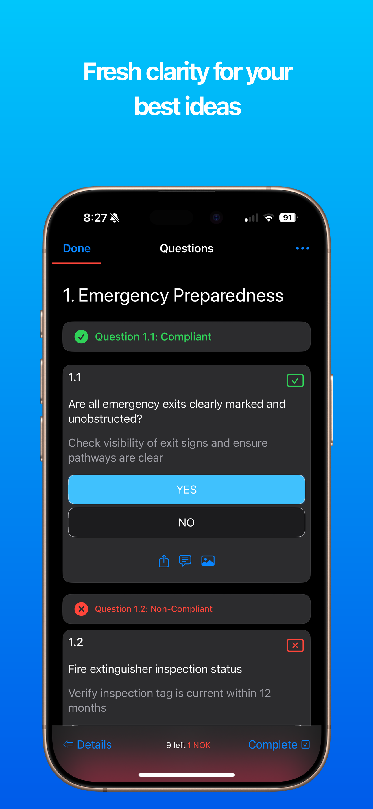
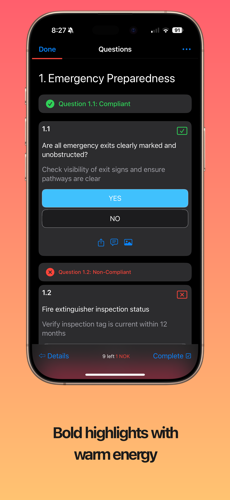
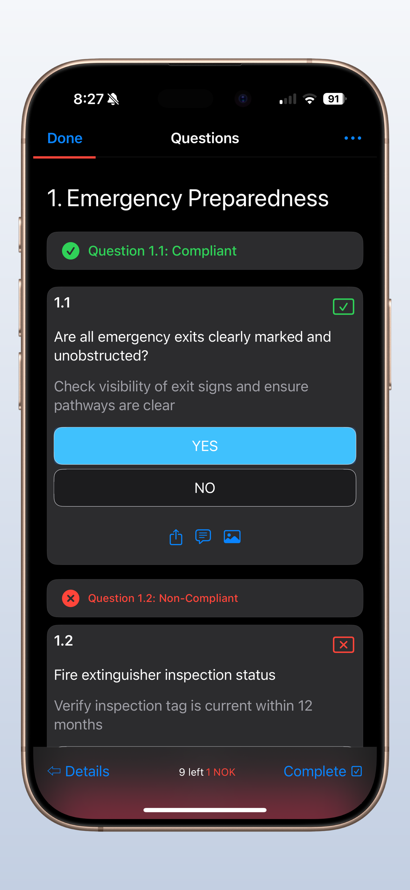
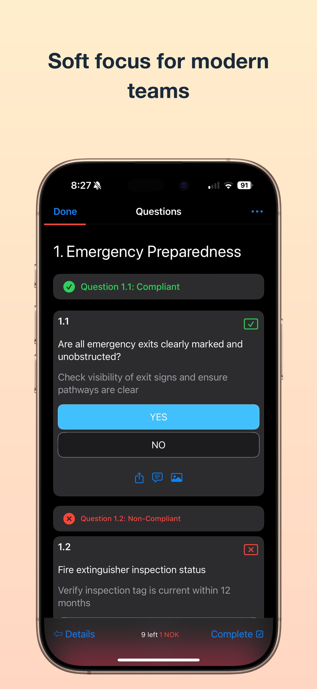
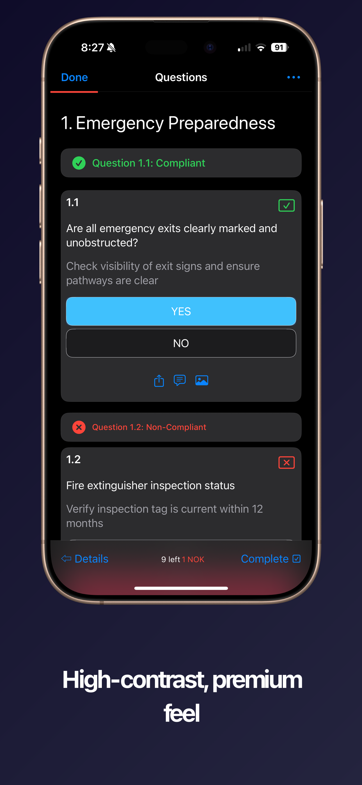
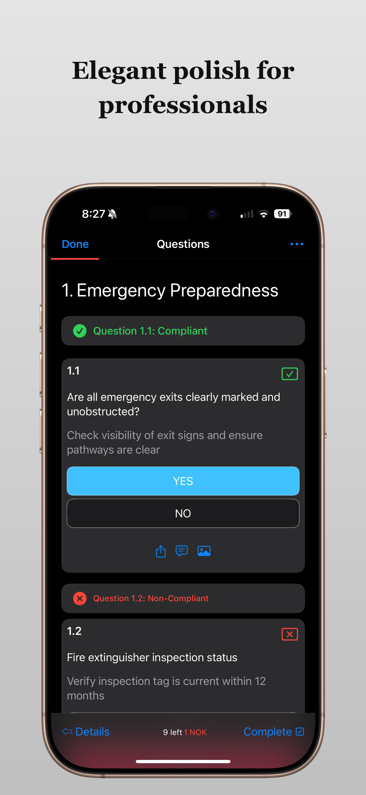
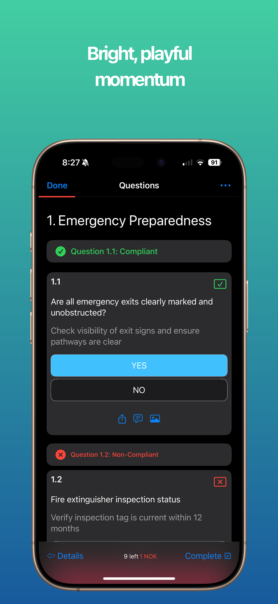
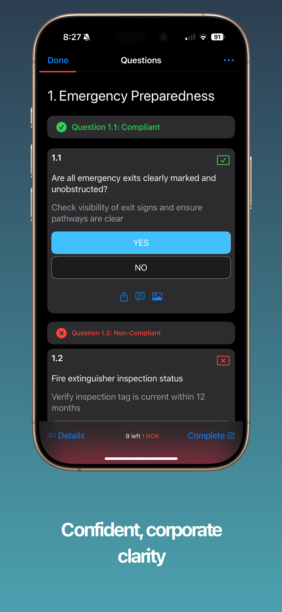
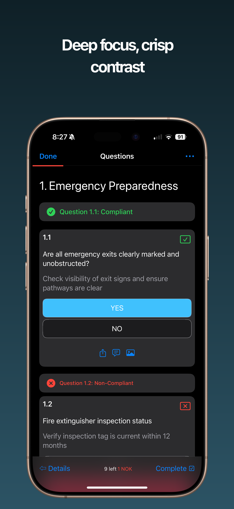

# Appshot Template Gallery

> Note: This gallery documents **v2 templates** (fixed layout modes: header/footer/screenshot-only). Legacy v1 templates are deprecated.

Professional screenshot templates for App Store success. Each template provides a complete visual style including background, layout mode, and caption styling.

## 🚀 Quick Start

```bash
# Interactive setup
appshot quickstart

# Or apply a specific template
appshot template ocean-header --caption "Your App Name"
```

## 📸 Template Samples

### Ocean Header

```bash
appshot template ocean-header
```

---

### Sunset Footer

```bash
appshot template sunset-footer
```

---

### Clean Screenshot

```bash
appshot template clean-screenshot
```

---

### Pastel Header

```bash
appshot template pastel-header
```

---

### Noir Footer

```bash
appshot template noir-footer
```

---

### Silver Header

```bash
appshot template silver-header
```

---

### Tropical Header

```bash
appshot template tropical-header
```

---

### Slate Footer

```bash
appshot template slate-footer
```

---

### Midnight Header

```bash
appshot template midnight-header
```

## 🎨 Template Comparison


## 🧪 Generate This Gallery Locally

To rebuild all images shown on this page using only assets in this folder:

```bash
# From repo root
npm run samples
```

This will:
- Build the CLI
- Use inputs from `template-samples/screenshots/{iphone|ipad|watch|mac}.png`
- Regenerate device samples in `iphone/`, `ipad/`, `watch/`, and `mac/` (9 presets each)
- Regenerate template cards in `gallery/` (e.g., `gallery/ocean-header-sample.png`)
- Create the combined `gallery/template-gallery.png`

Open `template-samples/index.html` in a browser to view the gallery and device tabs.

### Folder Structure

```
template-samples/
  index.html           # Gallery page (dark theme)
  README.md
  scripts/
    generate-all.sh    # One command to build everything locally
  screenshots/
    iphone.png         # Source inputs used by the generator
    ipad.png
    watch.png
    mac.png
  iphone/              # 9 generated presets for iPhone
  ipad/                # 9 generated presets for iPad
  watch/               # 9 generated presets for Watch
  mac/                 # 9 generated presets for Mac
  gallery/
    ocean-header-sample.png
    sunset-footer-sample.png
    clean-screenshot-sample.png
    pastel-header-sample.png
    noir-footer-sample.png
    silver-header-sample.png
    tropical-header-sample.png
    slate-footer-sample.png
    midnight-header-sample.png
    template-gallery.png
```

## 💡 Customization

Templates are starting points that you can customize:

```bash
# 1. Apply a template
appshot template ocean-header

# 2. Fine-tune settings
appshot style
appshot fonts --set "Poppins Bold"

# 3. Build
appshot build
```

## 📚 Learn More

- [Full Documentation](https://github.com/chrisvanbuskirk/appshot)
- [Command Reference](../README.md#-command-reference)
